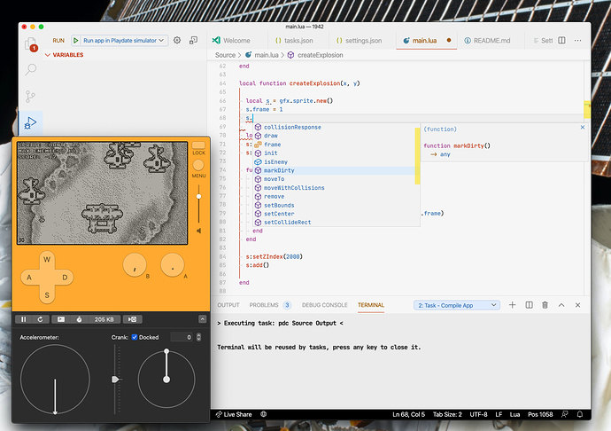

# VS Code Playdate

Adds a custom command to compile your code and run it in the [Playdate
Simulator](https://play.date/dev/).



## Getting Set Up

Since this plugin will need to access both `pdc` (the Playdate compiler) and the
actual simulator which is bundled in the SDK the plugin needs to be able to
determine where that is installed.

Either configure your environment variable `PLAYDATE_SDK_PATH` (will always
take precedence) or add it in the settings/launch config. While in the settings
it's also a good idea to add the Lua workspace libraries:

```json
{
  "Lua.workspace.library": [
    "/path/to/PlaydateSDK/CoreLibs"
  ]
}
```

## Command palette


To compile and run your code in the simulator through the command palette, hit
`Cmd + Shift + P` on Mac or `Ctrl + Shift + P` on Windows/Linux and look for
_"Run app in Playdate simulator"_.

By default, the plugin will use `source` as source argument and `output.pdx` as
output argument (**note**, these are case sensitive). If you want to use a
different source or output, add the following to `settings.json`:

```json
{
  "playdate.source": "Source",
  "playdate.output": "Output.pdx",
  // Optionally set sdkPath if not PLAYDATE_SDK_PATH is configured.
  // "playdate.sdkPath": "/path/to/PlaydateSDK"
}
```

They will both be _relative_ to the workspace root.

## Run as debugger

This plugin can also be configured to run as a debugger and launch the
simulator by hitting `F5` (or your configured key). To use it this way create
the following `.vscode/launch.json`:

```json
{
  "version": "0.2.0",
  "configurations": [
    {
      "request": "launch",
      "type": "playdate",
      "name": "Run app in Playdate simulator",
      "source": "${workspaceRoot}/source",
      "output": "${workspaceRoot}/output.pdx",
      // Optionally set sdkPath if not PLAYDATE_SDK_PATH is configured.
      // "sdkPath": "/path/to/PlaydateSDK"
    }
  ]
}
```

### Notes

The playdate version of Lua has a few extras:

- The `import` function
- `+=` and `-=`

To make VS Code not mark these as invalid syntax you can add the following to your `settings.json`:

```json
"Lua.runtime.nonstandardSymbol": [
  "+=",
  "-=",
  "*=",
  "/="
],
```
